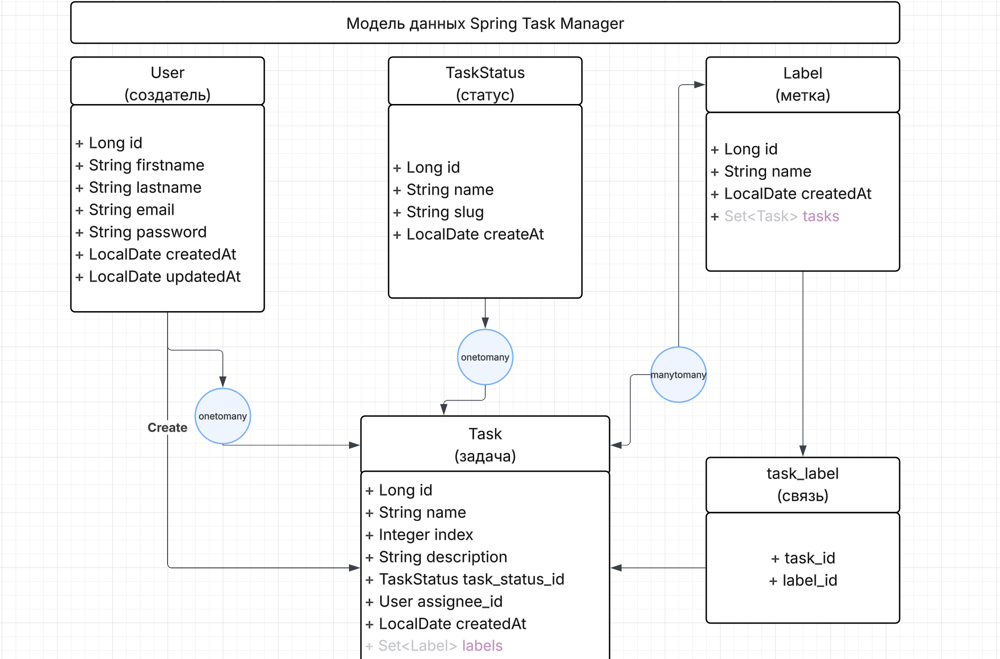
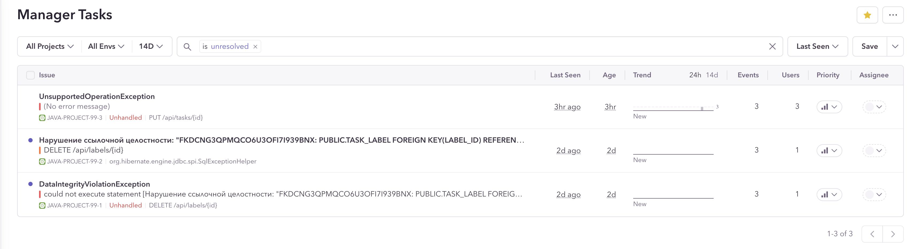

### Hexlet tests and linter status:
[](https://github.com/alexey4050/java-project-99/actions)
[](https://qlty.sh/gh/alexey4050/projects/java-project-99)
[](https://github.com/alexey4050/java-project-99/actions/workflows/ci.yml)
[](https://qlty.sh/gh/alexey4050/projects/java-project-99)
[](https://sonarcloud.io/summary/new_code?id=alexey4050_java-project-99)
[](https://sonarcloud.io/summary/new_code?id=alexey4050_java-project-99)

---
# Менеджер задач (Task manager)
Полнофункциональное веб-приложение для управления задачами с возможностью назначения исполнителей, установки статусов и категоризации задач.

## 🚀 **Демо**  
Приложение доступно по адресу

👉 https://java-project-99-04s6.onrender.com

**Тестовый доступ:**  
🔑 Логин: `hexlet@example.com`  
🔑 Пароль: `qwerty`

 ## 📦 Зависимости
- **Язык:** Java 21
- **Фреймворк:** Spring Boot 3.5.4
- **База данных:** PostgreSQL(для продакшн) H2(для разработки)
- **Сборка:** Gradle 8.14.2
- **Аутентификация:** JWT
- **Документация:** Swagger/OpenAPI 3.0
- **Мониторинг:** Sentry, Spring Boot Actuator
- **Тестирование:** JUnit 5, MockMvc, Instancio

---
## ✨ Особенности

- ✅ Создание и управление задачами с метками и статусами
- ✅ Назначение задач пользователям
- ✅ Фильтрация задач по различным параметрам
- ✅ Ролевая модель доступа (аутентификация и авторизация)
- ✅ Мониторинг ошибок через Sentry
- ✅ Полная документация API (Swagger)

## 🛠️ **Установка и запуск**

### **Локальная сборка**
1. Клонируйте репозиторий:
   ```
   git clone https://github.com/alexey4050/java-project-99.git
   cd java-project-99
2. Соберите проект:
    ```
   ./gradlew build
3. Запустите приложение:
    ```
   ./gradlew bootRun
   
Приложение будет доступно по адресу: http://localhost:8080

## 📊 Модель данных



### Основные сущности:
* Пользователи - управление учетными записями
* Задачи - основной рабочий элемент
* Статусы задач - workflow задач 
* Метки - категоризация задач

🐞 Отчеты об ошибках

Ошибки отслеживаются на Sentry:

